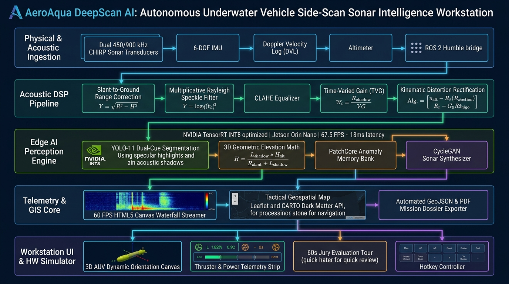

# Automated Underwater Marine Debris & Anomaly Detection System

[](https://react.dev/)
[](https://vitejs.dev/)
[](https://tailwindcss.com/)
[](https://fastapi.tiangolo.com/)
[](https://onnxruntime.ai/)
[](https://opensource.org/licenses/MIT)

> **Autonomous Underwater Vehicle (AUV) Side-Scan Sonar Perception & Analysis Workstation**  
> An integrated full-stack system combining computer vision anomaly detection, acoustic digital signal processing (DSP), real-world WGS-84 geotagging, interactive waterfall rendering, and hardware telemetry simulation for maritime surveys.

---

## 🌊 Overview

Side-scan sonar (SSS) is an essential imaging tool in underwater surveyance, pipeline inspection, and marine debris cleanup, particularly when optical visibility is compromised by depth, turbidity, or silt. Interpreting hours of acoustic waterfall logs manually is time-consuming and error-prone.

This project delivers a complete workstation comprising:
- **A FastAPI Backend Engine** executing image preprocessing (despeckling, CLAHE, shadow enhancement), ONNX-based deep learning inference, and telemetry-based geographic coordinate projections.
- **A React 19 Frontend Workstation** providing live acoustic waterfall sweeps, dual-screen signal analysis, interactive geospatial GIS mapping, synthetic sonar generation simulations, and subsea hardware telemetry monitoring.

---

## 🏛️ System Architecture



### End-to-End Pipeline

1. **Sonar Log & Image Ingestion**:
   - Accepts raw side-scan sonar image logs (PNG/JPEG) along with AUV navigation telemetry (latitude, longitude, heading angle, swath width, and altitude).
2. **Acoustic Preprocessing Pipeline (`backend/src/preprocessing/`)**:
   - **Rayleigh Speckle Denoising**: Spatial median filtering to suppress acoustic reverberation and backscatter noise while maintaining sharp obstacle boundaries.
   - **Contrast-Limited Adaptive Histogram Equalization (CLAHE)**: Normalizes gain variations across the sonar scanline without blowing out low-intensity shadow zones.
   - **Acoustic Shadow Enhancement**: Non-linear gamma curve remapping ($γ = 1.5$) to improve contrast in the acoustic shadow cast by seafloor targets.
3. **Detection Engine (`backend/src/model/`)**:
   - Object detection powered by an ONNX runtime session loaded from `weights/best.onnx`.
   - Classifies acoustic anomalies into maritime hazard categories: Shipwrecks, Ghost Nets, Pipes, Cylinders, and Debris.
   - Includes automatic graceful fallback to mock mode if weights are unmounted or absent.
4. **Geotagging & Coordinate Projection (`backend/src/utils/geotag.py`)**:
   - Converts 2D pixel offsets into metric distances across-track ($X$) and along-track ($Y$) relative to vehicle swath width.
   - Applies heading rotation and trigonometric geodesy over the WGS-84 coordinate model to compute the latitude and longitude of each detected object.
5. **Interactive Frontend Presentation (`frontend/src/`)**:
   - Live waterfall display, 3D shadow elevation calculations, tactical GIS mapping, and mission report generation.

---

## 🚀 Key Modules & Capabilities

### 1. Frontend Workstation (`frontend/`)
- **Live Sonar Waterfall (`LiveWaterfallView.jsx`)**:
  - Continuous dual-channel (port and starboard) acoustic sweep rendering on HTML5 canvas.
  - Multi-palette rendering: Grayscale, Amber, Emerald, Copper, Inverted, and Turbo colormaps.
  - Synthesizes dynamic acoustic speckle textures with optional periodic audio sonar ping feedback.
  - Overlay bounding boxes and acoustic shadow ray markers with adjustable swath range and scroll speeds.
- **Acoustic Studio & 3D Math (`AnalysisStudio.jsx`)**:
  - Split-screen comparison slider: Toggle between raw ping inputs and processed DSP outputs in real time.
  - Interactive target height profiling using acoustic shadow physics:
    $$\text{Target Height } (H) = \frac{L_{\text{shadow}} \times \left(H_{\text{alt}} \cdot \cos(\theta_{\text{pitch}}) \cdot \cos(\theta_{\text{roll}})\right)}{R_{\text{slant}} + L_{\text{shadow}}}$$
  - Live backend integration: Directly upload sonar files to the `/analyze` API, view detections with real-world coordinates, and export survey logs to CSV.
  - Live status indicator reporting backend connection state (`API ACTIVE` vs. `CLIENT DSP`).
- **Geospatial Tactical Map (`GeospatialMapView.jsx`)**:
  - Leaflet-powered GIS map using CARTO Dark Matter basemap tiles.
  - Plots survey path swaths, detected anomaly hotspots, coordinates, and classification tags.
  - Supports GeoJSON export for interoperability with external GIS software (QGIS, ArcGIS).
- **Synthetic Sonar Studio (`SyntheticStudio.jsx`)**:
  - Interactive simulator modeling acoustic backscatter across multiple seafloor sediment types (sand, gravel, mud).
  - Simulates highlight reflectivity and down-range shadow geometry based on debris dimensions and grazing angles.
- **Hardware Telemetry & Dynamics Simulator (`HardwareSimulatorView.jsx` & `Auv3DCanvas.jsx`)**:
  - Interactive 3D wireframe vehicle attitude rendering (pitch, roll, and yaw).
  - Simulates thruster output, battery voltage drain, board thermals, power draws, and telemetry packet streaming.
- **Edge NPU Benchmarking (`EdgeMetricsView.jsx`)**:
  - Comparative performance metrics across FP32, FP16, and INT8 quantizations on embedded architectures (NVIDIA Jetson, Coral TPU).
- **Mission Intelligence & Reporting (`ReportGenerator.jsx`)**:
  - Printable and downloadable hydrographic survey dossiers detailing mission stats, vehicle parameters, and detected targets.

### 2. Backend Perception Engine (`backend/`)
- **FastAPI REST API (`fastapi_server.py`)**:
  - Production-ready async REST service with CORS support and OpenAPI/Swagger documentation at `/docs`.
  - Serves static compiled frontend assets directly from `frontend/dist` when available.
- **Endpoints**:
  - `GET /health`: Model status, model path, and engine operational mode.
  - `POST /analyze`: Ingests an image file and navigation telemetry; returns detections, bounding boxes, geographic coordinates, and base64-encoded annotated visualization.
  - `GET /report/csv`: Generates and streams a CSV report of the latest detection run.
- **Streamlit Laboratory (`app.py`)**:
  - Standalone dashboard for offline exploration, side-by-side filter parameter tuning, and image analysis.
- **Scripts & Training Workflows (`scripts/`)**:
  - Model evaluation, training utilities (`train.py`, `train_v2.py`), background injection helpers, and benchmark output plots.
- **Automated Tests (`tests/`)**:
  - Pytest test suite covering preprocessing filters, image matrix transformations, and geotagging trigonometry.

---

## 🛠️ Tech Stack

| Domain | Technologies |
|:---|:---|
| **Frontend Framework** | React 19, Vite 8, Framer Motion |
| **Styling & Icons** | TailwindCSS v4, Lucide React |
| **Mapping & Charts** | Leaflet, CARTO Basemaps, Chart.js, React-ChartJS-2 |
| **Backend REST API** | FastAPI, Uvicorn, Pydantic |
| **Computer Vision & Math** | OpenCV (cv2), NumPy, SciPy |
| **Inference Runtime** | ONNX Runtime (CPU / CUDA Execution Providers) |
| **Data Processing & Lab** | Pandas, Pillow, Streamlit |
| **Testing & Quality** | Pytest, Oxlint |

---

## 🏁 Quick Start Guide

### Prerequisites
- **Node.js**: v18.x or later
- **Python**: v3.10 or later
- Package managers: `npm` and `pip`

### 1. Clone the Repository
```bash
git clone https://github.com/TanayThapar/Automated-Underwater-Marine-Debris-And-Anomaly-Detection-System.git
cd Automated-Underwater-Marine-Debris-And-Anomaly-Detection-System
```

### 2. Install Dependencies

**Option A: Automated Install (Root)**
```bash
npm run install:all
```

**Option B: Manual Installation**
```bash
# Install frontend packages
cd frontend
npm install
cd ..

# Install backend dependencies in your Python environment
cd backend
pip install -r requirements.txt
cd ..
```

---

## 🖥️ Running the Application

### Option A: Unified Full-Stack Runner
Launch both the backend API and frontend dev server with a single command:
```bash
./start.sh
```
- Frontend UI: `http://localhost:5173`
- Backend REST API: `http://localhost:8000`
- API Documentation: `http://localhost:8000/docs`

### Option B: Running Individual Services

- **FastAPI REST Backend**:
  ```bash
  cd backend
  python3 fastapi_server.py
  ```

- **Frontend Development Server**:
  ```bash
  cd frontend
  npm run dev
  ```

- **Standalone Streamlit Exploration Lab**:
  ```bash
  cd backend
  streamlit run app.py
  # Access at http://localhost:8501
  ```

---

## 🏗️ Production Build & Unified Serving

Build the frontend client bundle and serve both the API and client from FastAPI:

```bash
# 1. Compile the React application
npm run build:frontend

# 2. Start the FastAPI server (automatically mounts and serves frontend/dist)
npm run start:backend
```
Access the complete application at `http://localhost:8000`.

---

## 📡 REST API Reference

| Method | Endpoint | Parameters / Payload | Description |
|:---:|:---|:---|:---|
| `GET` | `/health` | None | Returns backend status and ONNX model load state. |
| `POST` | `/analyze` | `file`: Image (form-data)<br>`vehicle_lat`: float (default 14.5)<br>`vehicle_lon`: float (default 75.5)<br>`heading`: float (default 0.0)<br>`swath_width`: float (default 100.0) | Runs preprocessing, YOLO detection, and geotagging; returns detections, coordinates, and base64 annotated image. |
| `GET` | `/report/csv` | None | Streams downloadable CSV of the latest detection run. |
| `GET` | `/docs` | None | Interactive Swagger UI documentation. |

---

## ⌨️ Keyboard Shortcuts (Frontend)

| Key | Navigation View |
|:---:|:---|
| `1` | Live Sonar Waterfall Display |
| `2` | Acoustic Signal Studio & Math |
| `3` | Geospatial GIS Map |
| `4` | GAN Synthetic Texture Studio |
| `5` | Edge NPU Benchmarking |
| `6` | Mission Incident Report |
| `7` | SIH Pitch Guide & Specifications |
| `8` | Subsea Hardware Simulator |
| `J` | 60-Second Guided Tour |
| `?` | Keyboard Shortcuts Reference |

---

## 📂 Project Structure

```
Automated-Underwater-Marine-Debris-And-Anomaly-Detection-System/
├── frontend/                     # React 19 Client Application
│   ├── public/                   # Static icons & system architecture diagram
│   ├── src/
│   │   ├── assets/               # Sonar image textures & logos
│   │   ├── components/           # UI Views & modular components
│   │   │   ├── AnalysisStudio.jsx       # DSP analysis & live API client
│   │   │   ├── Auv3DCanvas.jsx          # 3D AUV vehicle orientation canvas
│   │   │   ├── EdgeMetricsView.jsx      # Edge NPU latency & power benchmarks
│   │   │   ├── GeospatialMapView.jsx    # Leaflet tactical survey map
│   │   │   ├── HardwareSimulatorView.jsx# Hardware telemetry simulator
│   │   │   ├── LiveWaterfallView.jsx    # Dual-channel side-scan sonar waterfall
│   │   │   ├── ReportGenerator.jsx      # Printable survey dossier
│   │   │   ├── SihPitchGuide.jsx        # Project specifications & architecture
│   │   │   └── SyntheticStudio.jsx      # Seafloor acoustic texture generator
│   │   ├── context/              # Global theme & telemetry state
│   │   ├── data/                 # Sonar sample catalogs & survey metrics
│   │   ├── utils/                # Client-side DSP, 3D math & API connector
│   │   │   ├── api.js            # Centralized FastAPI client
│   │   │   └── sonarProcessor.js # DSP filters & elevation geometry
│   │   ├── App.jsx               # Main dashboard container & router
│   │   ├── index.css             # Tailwind v4 theme styling rules
│   │   └── main.jsx              # Entry point
│   ├── package.json              # Frontend package definitions
│   └── vite.config.js            # Vite bundler config with /api reverse proxy
├── backend/                      # Python Perception & REST Engine
│   ├── app.py                    # Streamlit acoustic lab
│   ├── fastapi_server.py         # FastAPI REST service & static file server
│   ├── requirements.txt          # Python dependencies
│   ├── src/                      # Core backend processing packages
│   │   ├── model/                # ONNX YOLO inference implementation
│   │   ├── preprocessing/        # Rayleigh despeckling, CLAHE, shadow enhancement
│   │   └── utils/                # Trigonometric geotagging engine
│   ├── weights/                  # Pretrained ONNX model weights (best.onnx)
│   ├── scripts/                  # Training, data preparation, and evaluation scripts
│   └── tests/                    # Pytest verification suites
├── start.sh                      # Full-stack runner shell script
├── package.json                  # Root monorepo orchestration scripts
├── .gitignore                    # Global gitignore configuration
└── README.md                     # Project documentation
```

---

## 🧪 Testing

Run backend test suites:
```bash
cd backend
PYTHONPATH=. pytest tests
```

---

## 📄 License

This project is licensed under the [MIT License](LICENSE).
